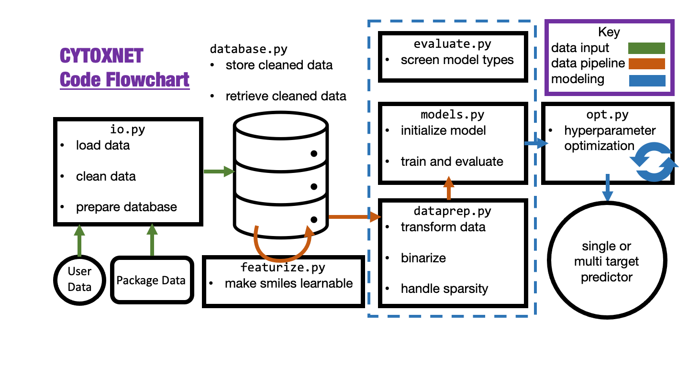
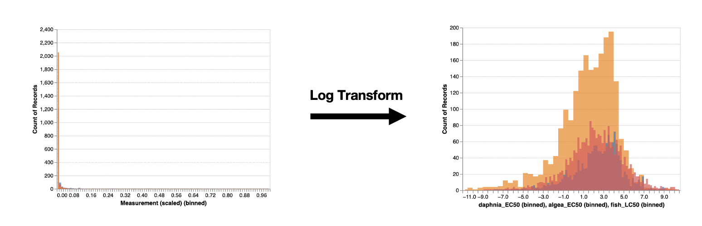
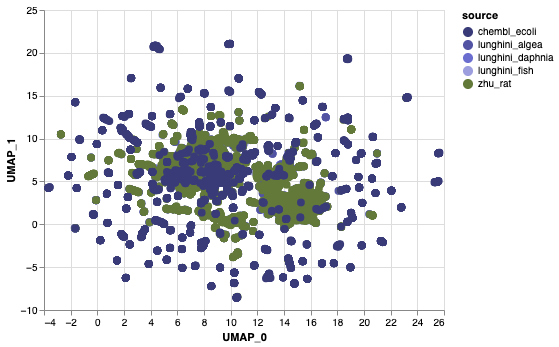
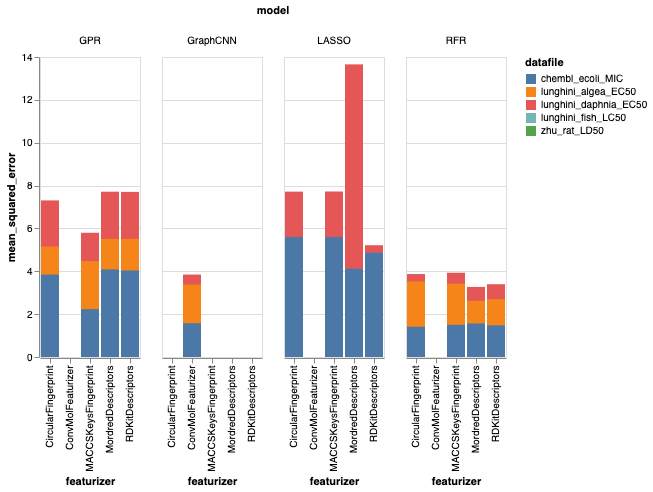

# cytoxnet  [](https://codecov.io/gh/Zymergen-DIRECT-2021/cytoxnet)

Toolbox for the machine learning prediction of cytotoxic effects of molecules on microbes.
Exploratory evaluation of multitask and transfer learning for microbe prediction using the created tools.

## installation
Create and activate conda environment, then run the package setup from the repository root:
```
conda env create --file environment.yml
conda activate cytoxnet
pip install tensorflow~=2.4
pip install .
```
The package can then be imported as `import cytoxnet`

## high level contents
Consult README files in folders for full contents and details.
```
`cytoxnet/`                              # The python package. See codeflow below
`docs/`
`|-component_spec.md`                     # Package component specifications
`|-results.md`                            # Summary of results from evaluation of models
`|-use_cases.md`                          # Package use cases.
`|-timeline.xlsx`                         # Gantt chart of quarter progress.
`|-data_reports/`                         # Distribution and stats for datasets in the pckg
`| |-dataset_overlap.ipynb`               # Analysis of dataset feature overlap space
`| |-chembl_ecoli.ipynb`                  # ChemBL E. coli query analysis
`| |-zhu_rat.ipynb`                       # Zhu's Rat LD50 dataset analysis
`| |-lunghini_ecotoxological.ipynb`       # Algea, Daphnia, and Fish dataset analysis
`|-database/`                              
`| |-create_dataset.py`                   # script to take create a database from package data
`|-model_screening/`                      # Initial screening of model and feature type
`| |-plot_results.ipynb`                  # visualization of results from model screening
`| |-evaluate_X_Y.py`                     # script to conduct grid screening
`|-multitask_learning/`                   # Contains comparison of multitask methods
`| |-multitask_evaluation_X.ipynb`        # determining optimized models final performance
`| |-classification/`                     # contains hyperparmeter opt for classification models
`| |-regression/`                         # contains hyperparmeter opt for regression models
`|-transfer_testing/`                     # optimization and evaluation of transfer learning
`| |-transfer_testing.ipynb`              # evaluation of optimized transfer models
`examples/`                               # example notebooks for using the package
`|-initialize_database.ipynb`             # combining package and user data to be used for learning
`|-feature_and_model_search.ipynb`        # screening model types and featurizers for single datasets
`|-using_ToxModels.ipynb`                 # initializing, training, and evaluating models
`|-hyperparameter_optimization.ipynb`     # finding best hyperparameters for a task
`|-loading_&_updating_data.ipynb`         # accessing database created after data cleaning
`|-preparing_data_for_learning.ipynb`     # tools for getting raw data into machine learning format
`environment.yml`                         # the conda package requirements
`LICENSE`                                 # License file
`MANIFEST.in`                             # defines package data to be included
`setup.py`                                # install script
```

## codeflow



## Datasets
Included in the package and needed for our exploratory evaluation is toxicity data from multiple species. See `/docs/data_reports` for more information. The references for these datasets are below:

ChemBL E. coli:
> https://www.ebi.ac.uk/chembl/. Query details - Query performed on website. Escherichia coli selected as target organism.  Compound activity selected.  Results narrowed down by specifying MIC as desired activity and ug/mL as desired units.  Results were downloaded as a CSV file and cleaned, log transformed.

Zhu Rat LD50:
> Zhu, Hao, et al. “Quantitative structure− activity relationship modeling of rat acute toxicity by oral exposure.” Chemical research in toxicology 22.12 (2009): 1913-1921.

Lunghini fish, daphnia, algae:
> F. Lunghini, G. Marcou, P. Azam, M. H. Enrici, E. Van Miert, and A. Varnek, “Consensus QSAR models estimating acute toxicity to aquatic organisms from different trophic levels: algae, Daphnia and fish,” SAR QSAR Environ. Res., vol. 31, no. 9, pp. 655–675, Sep. 2020, doi: 10.1080/1062936X.2020.1797872.

## Motivation
The primary goal of this project is to explore the use of multitask and transfer learning for predicting cytotoxic effects of individual molecules to microbes. Leveraging microbial metabolism as a means of large scale bio-production is common practice in a range of industries, such as biopharmaceuticals.  Microbial cultures can be finicky, however, and adding too much of an additive, or a toxic additive, or an additive that will be converted into a toxic metabolite can put a 2,000L bioreactor out of commission for weeks.  Having the ability to predict the cytotoxic effects of any given compound on a bacterial culture could decrease scale-up time and reduce financial risk for both industrial and synthetic biology research groups.  Datasets with compound activity values for specific target species are usually very small, however, and producing one for each species of interest defeats the purpose of prediction in the first place. Some work has shown promise of predicting toxicity across species using multitask and consensus models.

In ecological settings:
> F. Lunghini, G. Marcou, P. Azam, M. H. Enrici, E. Van Miert, and A. Varnek, “Consensus QSAR models estimating acute toxicity to aquatic organisms from different trophic levels: algae, Daphnia and fish,” SAR QSAR Environ. Res., vol. 31, no. 9, pp. 655–675, Sep. 2020, doi: 10.1080/1062936X.2020.1797872.

And in mammalian targets:
> S. Jain et al., “Large-Scale Modeling of Multispecies Acute Toxicity End Points Using Consensus of Multitask Deep Learning Methods,” J. Chem. Inf. Model, vol. 17, p. 46, 2021, doi: 10.1021/acs.jcim.0c01164.

Here, we broach the topic if trying to leverage such techniques for prediction in the synthetic biology process context.

## Strategy
We wrote a number of tools to aid in this investigation. See the codeflow diagram. 

A sweep of literature and available data was conducted in order to identify the datasets above. The "data problem" in machine learning is especially prevalent here, with toxicity data coming from many sources, and being hindred by eg. right censoring and imprecise measurements. 

For the exploration itself, given the largest need for cross-species learning in the smallest datasets, we use the Lunghini algae EC50 dataset as our test target. To do this, we consider a small independent test set of algae data to compare all models explored. The remaining algae data, as well as the data from 4 other species, is used as a development dataset to experiment on modeling techniques.

We first screen model types for regression (LASSO, GPR, RFR, GCNN) and classification (GPC, RFC, KNNC, GCNN) along with featurization techniques for the molecules such as Mordred descriptors and Circular Fingerprints for the most promising models. We then conduct extensive hyperparemeter optimization for a small set of promising model/feature combinations. Continuous variables were binarized by considering the dataset distribution for classification tasks. The optimized models, including both baseline single task algae models and exploratory multitask and transfer learning models, were finally compared on predictive power on the independent algae test set.

## Results
We chose datasets in literature emphasizing a wide range of species, while also trying to avoid unclean or inconsistent datasets, which is not always possible. For example, a ChemBL query for E. coli was included to give representation to microbes, but the contained data is imprecise, reporting MIC values at defined intervals, and is also in some cases right censored. Each dataset investigated had a fairly severe bias towards toxic compounds. See Figure 1 below. Taking the logarithm of the toxicity produces a more normal distribution lending itself to learning, however does not remove the bias (Fig. 1).




Because of the bias in the data, we expect models to be more capable of predicting in the toxic regime, though this is not necessarily desired. Investigation of the overlap of the 5 target datasets using UMAP dimensionality reduction of the molecules shows that the microbe (E. Coli) data generally has much less overlap than the other targets, which we postulate is a big contributor to poor cross-species learning performance. See Figure 2 below.



Screening of models and features pointed towards molecular descriptors such as RDKitDescriptors paired with Random Forests, as well as graph convolutional neural networks being top performers. See Figure 3 below.



As a baseline, single target (algea) random forest and graph neural nets were used. Multitask (all 5 targets) random forest and graph models were compared to these. For each model testd, extensive hyperparameter optimization using the Klone high performance computing cluster and the TPE hyperparameter sampling method was conducted using the development dataset.

Random forest multitask models, while proving the best in initial screening, do not accept sparse weights, and thus require imputation for multitask sparse models. We explored rudimentary mean imputation and iterative interpolating imputation as possible solutions, each receiving their own hyperparmeter optimization. For graph models, instead of imputation, sparsity was masked with 0.0 weights for training. For classification, targets were binarized by considering the most toxic 90% of each dataset as toxic, and the remaining 10% as non toxic. This was done because binarizing at the halfway point would mask the effects of our biased datasets, and the 90% more closely matches the distribution of the high quantity of toxic data and the trailing tails of less toxic data. See Figure 5. Due to this bias, precision score was considered for hyperparameter optimization and final evaluation, which would not be effected by the dataset bias towards toxic compounds in the case of a mean-predicting model as recall score would be. The performance for all models explored on the held out algae test set is shown below. Visualizations of the best regressors and classifiers on the independant algea test set are shown in Figures 6 and 7.

Figure 5: Kernel Density of E. Coli dataset with the 90th percentil considered toxic marked as red, and the remaining nontoxic data as green. We note the broken axis as the dataset has a huge tail of nontoxic and right censored data with low representation in the overall very toxic dataset. Distribtutions of all other datasets show simialr results.


Figure 6: Pairity plot of best regressors. We no that no model approaches a perfect model (black line), however the trend for the transfer learned model is the most competative with the baselines, and the multitask model falling behind. Multitask random forests with imputed data not included due to poor performance.


Figure 7: ROC curve for baseline RFC and Graph multitask model. We see that the graph model is competative, indicating that with better tuning sparse data may be utilized to improve upon single target classifiers.


Regression - Reported R2 score

| method | R2 Score |
| ------ | -------- |
| baseline RFR single task | 0.475 |
| mean imputed RFR multitask | 0.174 |
| interpolated RFR multitask | 0.135 |
| graph CNN multitask with sparse weights | 0.405 |
| baseline GCNN | 0.380 |
| GCNN transferred from large dataset | 0.399 |


Classification - Reported precision score

| method | Precision Score |
| ------ | -------- |
| baseline RFC single task | 0.906 |
| mean imputed RFC multitask | 0.454 |
| interpolated RFC multitask | 0.477 |
| graph CNN multitask with sparse weights | 0.919 |
    
## Conclusion and future work
Graph models were the most promising for cross species training. They were not as negatively impacted by sparse data as random forests (with the imputation methods used), and in the case of classification actually performed better than the baseline single task model. Initial tests on transfer learning also showed that larger datasets of different species could be used to improve graph models trained on small species of interest. Overall however, no model significantly outperformed simple and easy to use single target Random Forests even with heavy optimization. Issues with handling sparse datasets makes this a problem much more complicated than expected: either very careful consideration of data ensuring heavy overlap and specific choice of dependable examples to leverage imputation strategies, or very careful consideration and optimization of the model itself maximizing ability to learn from poorly curated and sparse datasets is necessary. For future steps, we would involve more data and carefully curate a less sparse training set to ensure overlap and trainability as the crux of the issue. To deal with imprecision in toxicity metrics (discontinuous/granular concentrations during testing) and other issues such as data censoring, we recommend splitting the task and data into regions of high toxicity, intermediate toxicity, and low toxicity. For the cleaned and curated sparse multitask continuous dataset, one would choose a maximum toxicty bound after which no compound is interesting, and choose a lower  toxicity bound that is an acceptably low toxicity and ideally contains all of the right censored data. The range in between would be the toxicity range of interest for the process. A multitask classifier could be trained to predict toxic/intermediate/nontoxic, and then a multi or single task regressor could be trained on only intermediate data to approximate the toxicity value. This prediction, as seen from our results, would likely be fairly imprecise, but due to the initial screening it would not be excessively toxic or totally non toxic. This would then allow for estimation of toxicity for the region of interest, and guide experimentation towards a smaller group of compounds.

##Acknowledgements

We would like to thank our sponsor Dr. Kurt Thorn of Zymergen for the guidance throughout this course. Additionally, this was only possible through the DIRECT program and fascilitated by Prof. Beck and Prof. Schwartz. Special thanks to Dr. Crystal Humphries and Dr. Janet Matsen for providing additional guidance.
